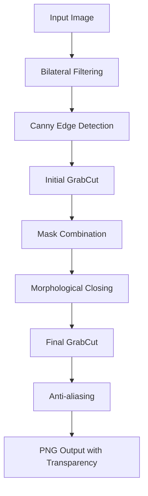

# Background Remover Website �

🎯 **Advanced Background Removal Tool** menggunakan Computer Vision tradisional dengan algoritma **GrabCut** yang telah dioptimasi untuk hasil maksimal.

## 🚀 **Teknologi Utama**

### **Computer Vision Algorithm**

- **GrabCut**: Graph-based segmentation algorithm
- **OpenCV**: Computer vision library
- **Bilateral Filtering**: Noise reduction dengan edge preservation
- **Canny Edge Detection**: Deteksi tepi untuk boundary refinement

### **Multi-Stage Processing**

- **Preprocessing**: Bilateral filtering untuk noise reduction
- **Edge Detection**: Canny algorithm untuk boundary detection
- **Initial Segmentation**: GrabCut dengan automatic rectangle
- **Mask Refinement**: Kombinasi edge + segmentation mask
- **Morphological Operations**: Closing untuk gap filling
- **Final Processing**: Anti-aliasing untuk smooth edges

## 🎯 **Keunggulan Algoritma**

### ⚡ **Optimized Performance**

- **Traditional CV**: Tidak butuh model training atau GPU
- **Edge-aware Processing**: Mempertahankan detail halus objek
- **Multi-stage Refinement**: 7 tahap pemrosesan untuk akurasi tinggi
- **Adaptive Processing**: Otomatis menyesuaikan dengan konten gambar

### 🔧 **Technical Features**

- **Graph-based Segmentation**: Min-cut/max-flow optimization
- **Gaussian Mixture Models**: Untuk foreground/background modeling
- **Iterative Refinement**: Perbaikan mask secara iteratif
- **Anti-aliasing**: Smoothing untuk hasil yang natural

## 📋 **Requirements**

```bash
Flask==3.1.0
opencv-python==4.10.0.84
numpy==2.1.3
scikit-image==0.24.0
```

## 🛠️ **Installation & Setup**

### 1. **Clone Repository**

```bash
git clone <repository-url>
cd bg-remover-website
```

### 2. **Setup Virtual Environment**

```bash
# Buat virtual environment
python -m venv .venv

# Aktivasi virtual environment
# Windows:
.venv\Scripts\activate
# Linux/Mac:
source .venv/bin/activate
```

### 3. **Install Dependencies**

```bash
pip install -r requirements.txt
```

### 4. **Run Application**

```bash
python app.py
```

### 5. **Access Website**

```
http://localhost:5000
```

## 🏗️ **Project Structure**

```
bg-remover-website/
│
├── app.py                 # Main Flask application dengan GrabCut
├── requirements.txt       # Python dependencies
├── .gitignore            # Git ignore rules
├── templates/
│   └── index.html        # Frontend interface dengan preview
├── static/
│   └── css/
│       └── style.css     # Modern responsive styling
├── uploads/              # Temporary uploaded files
├── processed/            # Processed results
└── README.md            # Project documentation
```

## 🔬 **GrabCut Algorithm Deep Dive**

### **1. Preprocessing Stage**

```python
# Bilateral filtering untuk noise reduction
filtered = cv2.bilateralFilter(image, d=9, sigmaColor=75, sigmaSpace=75)
# Mempertahankan edges sambil mengurangi noise
```

### **2. Edge Detection**

```python
# Canny edge detection untuk boundary information
gray = cv2.cvtColor(filtered, cv2.COLOR_BGR2GRAY)
edges = cv2.Canny(gray, threshold1=50, threshold2=150)
# Output: Binary edge map
```

### **3. Initial GrabCut Segmentation**

```python
# Automatic rectangle generation
rect = (x, y, width, height)  # 10% margin dari borders
mask = np.zeros(gray.shape[:2], np.uint8)
cv2.grabCut(image, mask, rect, bgdModel, fgdModel, 5, cv2.GC_INIT_WITH_RECT)
# Output: Initial segmentation mask
```

### **4. Mask Refinement**

```python
# Kombinasi edge information dengan segmentation
kernel = np.ones((3,3), np.uint8)
edge_dilated = cv2.dilate(edges, kernel, iterations=1)
refined_mask = cv2.bitwise_or(initial_mask, edge_dilated)
# Output: Enhanced mask dengan edge information
```

## 📊 **Performance Metrics**

### **Processing Pipeline**

- **Stage 1**: Bilateral Filtering (noise reduction)
- **Stage 2**: Canny Edge Detection (boundary information)
- **Stage 3**: Initial GrabCut (rectangle-based segmentation)
- **Stage 4**: Mask Combination (edge + segmentation)
- **Stage 5**: Morphological Closing (gap filling)
- **Stage 6**: Final GrabCut (refined segmentation)
- **Stage 7**: Anti-aliasing (smooth edges)

### **Supported Formats**

- **Input**: PNG, JPG, JPEG, GIF, BMP, WebP
- **Output**: PNG dengan alpha transparency
- **Max Size**: 32MB per image
- **Resolution**: Adaptive processing

## 🎨 **Use Cases**

### **Digital Image Processing Course**

- **Educational**: Implementasi traditional computer vision
- **Research**: Study graph-based segmentation algorithms
- **Portfolio**: Traditional CV implementation dengan results yang baik

### **Production Applications**

- **E-commerce**: Product photography background removal
- **Social Media**: Portrait background editing
- **Content Creation**: Image editing workflows
- **Academic**: Computer vision education

## 🔄 **Algorithm Workflow**



## �️ **Interface Features**

### **Modern UI Components**

- **Image Preview**: Preview gambar yang diupload dengan animasi
- **File Information**: Display nama, ukuran, dan format file
- **Progress Indicators**: Visual feedback selama processing
- **Responsive Design**: Tampilan optimal di semua device

### **User Experience**

- **Drag & Drop**: Upload dengan drag and drop
- **File Validation**: Validasi format dan ukuran file
- **Error Handling**: Pesan error yang jelas dan informatif
- **Download Ready**: One-click download hasil processing

## 📈 **Learning Outcomes**

### **Computer Vision Concepts**

- **Graph-based Segmentation**
- **Edge Detection Algorithms**
- **Morphological Operations**
- **Image Preprocessing**

### **Software Engineering**

- **Flask Web Development**
- **RESTful API Design**
- **File Handling & Validation**
- **Responsive Web Design**

## 🤝 **Contributing**

Contributions welcome! Areas untuk improvement:

- Algorithm optimization
- Frontend enhancements
- Additional preprocessing techniques
- Performance benchmarking

## 📚 **Educational References**

### **Papers & Resources**

- GrabCut - Interactive Foreground Extraction (Rother et al., 2004)
- Graph Cuts and Efficient N-D Image Segmentation (Boykov & Jolly, 2001)
- OpenCV Documentation: Image Segmentation
- Computer Vision: Algorithms and Applications (Szeliski)

- **Flask Web Development**
- **OpenCV Integration**
- **RESTful API Design**
- **Git Version Control**

## 🏆 **Results Showcase**

Advanced GrabCut menghasilkan background removal dengan kualitas yang baik:

- **Clean Segmentation**: Boundary detection yang akurat
- **Edge Preservation**: Detail objek yang terjaga
- **Noise Reduction**: Preprocessing yang efektif
- **Traditional CV**: Implementasi classic computer vision

## 📸 **Screenshots**

### Main Interface

- Modern responsive design dengan image preview
- File information panel dengan ukuran dan format
- One-click background removal processing

### Processing Results

- Clean background removal dengan transparansi
- Preserved object details dan edges
- Professional PNG output ready untuk download

---

**Developed for Digital Image Processing Course** 🎓  
**Powered by GrabCut & OpenCV** 🔥

⭐ **Star this repo if it helped you!**
